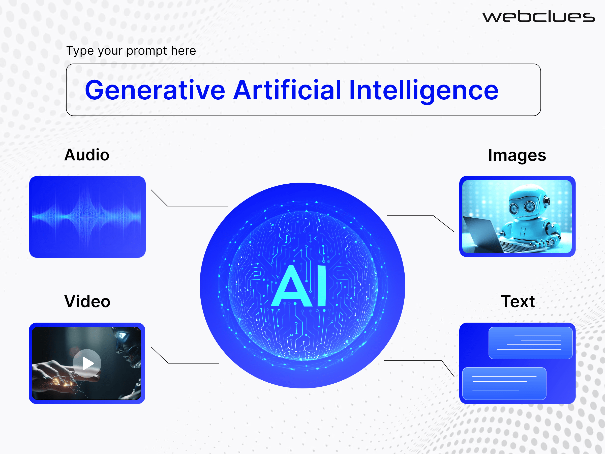

# What is generative AI?
Generative AI is type of artifical integlligence that helps to creates new contents like text, images, audios and videos based on user prompts. Generative AI refers to deep-learning models that can generate high-quality text, images, and other content based on the data they were trained it.

## ⚙️ How Does It Works?
Generative AI works by using machine learning models (a program, created by use of algorithms that can learn from data). These models used the LLMs (Large Language Models)

## Real World applications of generative ai:
Generative AI has widely impact in common industries like 
- Health Care Industry: 
  - Generative AI is revolutionizing the Health care by supports the virtual health assitants. However, ethical concrns like data privacy and data authentication of health care data must be carefully managed.
- Finance :
  - It can improve fraud detection and risk management by analyzing vast datasets and recommending personalized investment strategies and history of data.
- Marketing:
  - It can generate personalized content for marketing and improve custromer services and engagement of tailoring marketing messages and product recommendations
- Software Development:
  - Generative AI can assist coding, debugging and generating documentation related to content
- Customer Services :
  - Chatbot is an example of generative ai that handle customer inquirers and questions for content related.
  